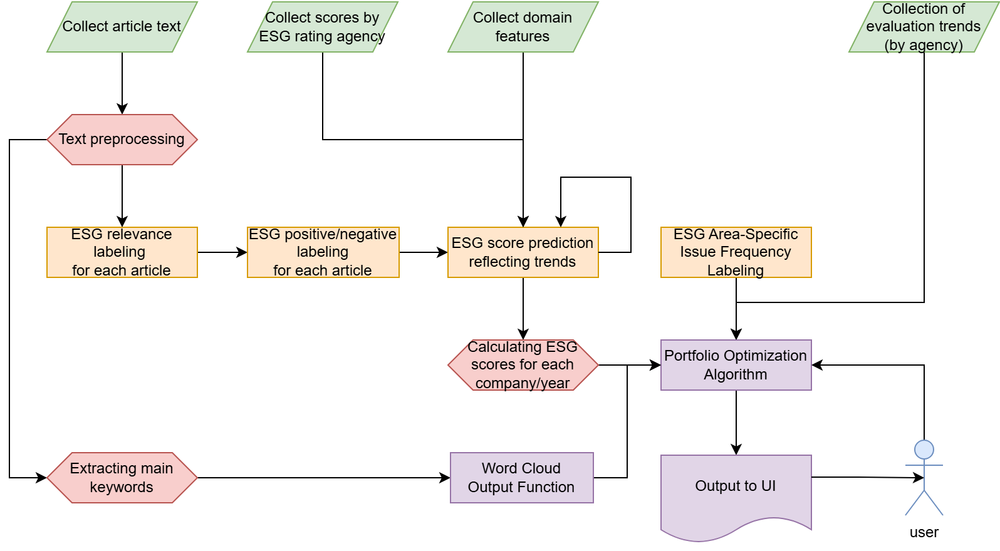

**🌐 Available Versions:**  [🇰🇷 한국어 (Korean)](/README_KR.md) | [🇯🇵 日本語 (Japanese)](/README_JP.md)  

---

# LLM-based ESG-Focused Portfolio Optimization Service📊🌱

> 🏆🥈Excellence Award(2nd) at the 8th Industry-Academia Software Project Exhibition of Kwangwoon University  
> 🏆🥈Excellence Award(2nd) at the 2024 Graduation Exhibition of Kwangwoon University College of AI Convergence


This repository hosts the **LLM-based ESG-Focused Portfolio Optimization Service** project. By integrating ESG (Environmental, Social, Governance) criteria and advanced portfolio optimization techniques, this service provides users with a personalized ESG-driven investment portfolio. Using a large language model (LLM) to process and evaluate text data, the service enables investors to assess companies' ESG scores and generate optimized portfolios based on their preferences.

## Project Introduce focused on UI/UX
**If you want to watch UI/UX introducing Video, Click the below  video Thumbnail.**

(Sorry but please right-click the Thumbnail and select **'Open link in new tab'**, if you want keep this tab.)

[](https://www.youtube.com/watch?v=kHAtgLC4PJY)

## Table of Contents
1. [Project Overview](#project-overview)
2. [Key Features](#key-features)
3. [Installation](#installation)
4. [Usage](#usage)
5. [Project Structure](#project-structure)
6. [Technologies Used](#technologies-used)
7. [Requirements](#requirements)
8. [Future Extensions](#future-extensions)
9. [New Features](#new-features-2024-update)
10. [Version History](#version-history)
11. [Contributing](#contributing)
12. [Support and Feedback](#support-and-feedback)
13. [License](#license)
14. [About](#about)

## Project Overview
In recent years, ESG has become a critical metric for assessing a company's long-term sustainability and stability. However, traditional ESG evaluation methods often lack transparency and accessibility for non-expert investors. This project addresses these issues by providing a user-centered, transparent ESG evaluation system using an LLM, which performs text-based assessments and applies the Black-Litterman model for portfolio optimization. Through this, the system generates customized portfolios that balance ESG factors and financial returns according to user preferences.

### Core Objectives
1. **Technical Implementation**: Develop a pipeline using LLM for ESG assessment and produce an optimized portfolio.
2. **User-Centered Service**: Provide personalized portfolio construction with ESG evaluation based on user-selected criteria and preferences.

## Key Features
1. **Text Data Collection and Processing**  
   - Collect articles related to selected companies from various sources using `Selenium` and `BeautifulSoup`, storing the data in `MongoDB` for efficient management.
   - Preprocess the collected data, anonymizing company names and filtering irrelevant content to ensure high data quality.
   
2. **LLM-based ESG Scoring**
   - Use an LLM (via the OpenAI API) to evaluate collected articles based on ESG relevance, extracting and labeling content by ESG factors and sentiment.
   - Fine-tune a `KoElectra` model for classification, allowing independent ESG assessments without API dependency.

3. **Comprehensive ESG Evaluation**
   - Utilize user input for adjusting weights on ESG factors (environmental, social, governance) to customize scoring.
   - Adjust scores dynamically based on investment style preferences: financial-centered, ESG-centered, or balanced.
   - Apply a scoring model that integrates multiple ESG rating agencies' criteria to build a comprehensive score, enabling evaluation for companies outside major agency coverage.

4. **Enhanced Portfolio Optimization via Black-Litterman Model**
   - Implement year-by-year optimization approach using ESG data from multiple rating agencies (MSCI, S&P, Sustainalytics, ISS, ESG기준원).
   - Utilize the Ledoit-Wolf method for robust covariance matrix estimation, improving numerical stability.
   - Apply user trust weights to ESG scores, creating a personalized view vector for the Black-Litterman model.
   - Calculate optimized portfolio weights by maximizing the Sharpe ratio through quadratic programming with `scipy.optimize`.
   - Store and analyze yearly investment weights to track portfolio performance over time (2020-2025).
   - Implement robust error handling for data gaps and numerical computation issues.

5. **User Interface with Streamlit**
   - A user-friendly interface allows users to input ESG preferences and visualize optimized portfolios.
   - Interactive sliders for ESG weights and investment styles, providing an intuitive way to construct personalized portfolios.
   - Visualization of portfolio metrics, including expected return, volatility, and Sharpe ratio.

## Installation
1. **Clone the Repository**:
   ```bash
   git clone https://github.com/fairyofdata/LLM-ESG-POS.git
   cd LLM-ESG-POS
   ```

2. **Install Required Packages**:
   ```bash
   pip install -r requirements.txt
   ```

3. **Run Streamlit Application**:
   ```bash
   streamlit run app.py
   ```

## Usage
1. **Data Collection**: Configure company tickers and data sources for article collection.
2. **Set ESG Preferences**: Use the Streamlit UI to define weights for environmental, social, and governance factors.
3. **Investment Style Selection**: Choose from financial-centered, ESG-centered, or balanced portfolio options.
4. **View Portfolio Results**: See portfolio composition and performance metrics, including expected return and volatility.

## Project Structure

```plaintext
├── data/                   # Data and ESG score tables
├── src/                    # Source code for ESG scoring and portfolio optimization
│   ├── data_processing.py   # LLM-based text processing
│   ├── esg_scoring.py       # ESG scoring functions
│   ├── portfolio_optimization.py  # Optimization with Black-Litterman
│   └── ui/                  # Streamlit UI code
├── app.py                  # Main application script
├── README.md               # Project documentation
└── requirements.txt        # List of dependencies
```

## Technologies Used
- **Data Processing**: Python, Pandas, NumPy
- **Web Scraping**: Selenium, BeautifulSoup4
- **Database**: MongoDB
- **Machine Learning**: scikit-learn, KoElectra
- **Portfolio Optimization**: Black-Litterman model, SciPy, cvxopt
- **Data Visualization**: Plotly, Matplotlib
- **UI/UX**: Streamlit
- **LLM Integration**: OpenAI API

## Requirements
- Python 3.8+
- scikit-learn 1.0.0+
- pandas 1.3.0+
- numpy 1.20.0+
- streamlit 1.10.0+
- yfinance 0.1.70+
- FinanceDataReader 0.9.0+

## Future Extensions
1. **Expanded ESG Evaluation**: Integrate additional ESG rating sources and add real-time news updates for responsive scoring.
2. **Scalability for Non-listed Companies**: Develop scoring mechanisms that leverage LLMs to assess startups and non-public companies.
3. **Improved Constraints in Optimization**: Include sector-specific constraints for better portfolio diversification.
4. **Time-Series Portfolio Analysis**: Extend the year-by-year optimization approach to provide historical performance comparisons and trend analysis.

## New Features (2024 Update)
- **Year-by-Year Portfolio Optimization**: Track investment performance across multiple years
- **Multi-Agency ESG Data Integration**: Comprehensive scoring from five major ESG rating agencies
- **Enhanced Stability**: Improved covariance estimation and numerical computation techniques
- **Interactive Portfolio Visualization**: Detailed insights into portfolio composition and performance

## Version History
- **v2.0** (March 2025): Enhanced optimization algorithm and multi-agency ESG data integration
- **v1.0** (November 2024): Initial release with basic ESG scoring and portfolio optimization

## Contributing
Contributions are welcome! If you'd like to improve this project, please follow these steps:
1. Fork the repository
2. Create a feature branch (`git checkout -b feature/amazing-feature`)
3. Make your changes and commit (`git commit -m 'Add amazing feature'`)
4. Push to your branch (`git push origin feature/amazing-feature`)
5. Open a Pull Request

## Support and Feedback
If you encounter any issues or have suggestions for improvements, please submit an issue on our GitHub repository.

## License
This project is licensed under the MIT License. See the [LICENSE](LICENSE) file for details.

## About 
**KWU 8th Industry-Academic Cooperation SW Project & AI Convergence Graduation Project**
- **Adviser**: Professor Cho Min-soo (Department of Information Convergence at Kwangwoon Univ.)
- **Applied company**: Billions Lab (Dr. Soo-jin Pyo)
- **Contributor**: Team KWargs (Baek Ji-heon (PM), Kim Na-yeon, Jang Han-jae)
