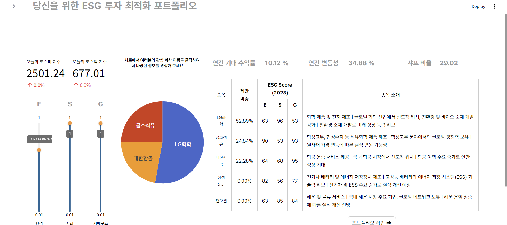
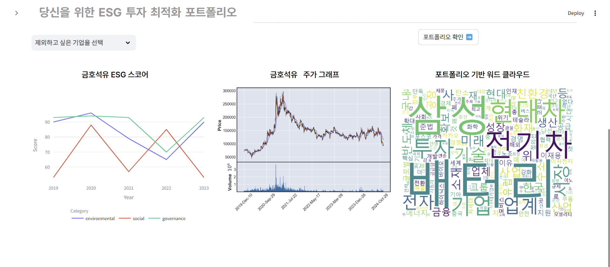
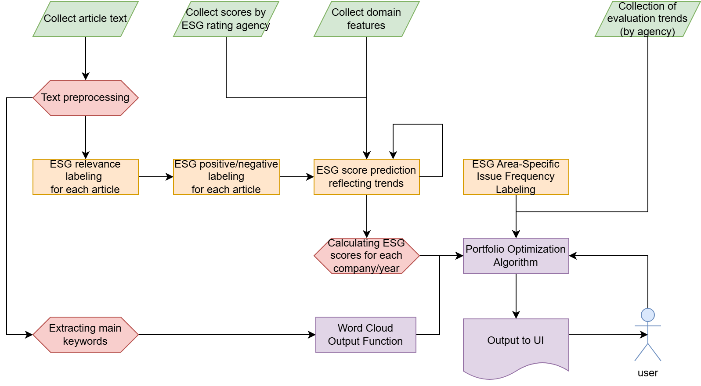

**🌐 Available Versions:** [🇺🇸 English](/README.md) | [🇯🇵 日本語 (Japanese)](/README_JP.md)

---

# LEPOS: LLM 기반 ESG 중심 포트폴리오 최적화 서비스 📊🌱

> 🏆🥈 광운대학교 제8회 산학연계 SW 프로젝트 전시회 우수상(2위)
> 🏆🥈 광운대학교 SW융합대학 2024년 졸업전시회 우수상(2위)


[](https://github.com/fairyofdata/LLM_ESG_POS/actions/workflows/tests.yml)

LEPOS는 **LLM과 파인튜닝된 한국어 언어 모델로 뉴스 텍스트에서 직접** 국내 상장사의
ESG(환경/사회/지배구조)를 평가하고, 사용자의 ESG 선호도를 투자자 전망(view)으로
반영하는 **Black-Litterman 최적화**로 개인 맞춤형 포트폴리오를 구성하는 서비스입니다.

기존 ESG 평가는 산출 근거가 불투명하고, 기관마다 결과가 다르며, 대기업만 커버합니다.
LEPOS는 스코어링 파이프라인 전체가 투명하게 공개되어 있고, 5개 평가기관(MSCI, S&P,
Sustainalytics, ISS, ESG기준원)의 평가 경향을 학습하며, 텍스트만 있으면 되기 때문에
평가기관이 커버하지 않는 기업도 평가할 수 있습니다.

## 🎬 데모

[](https://www.youtube.com/watch?v=kHAtgLC4PJY)

*(썸네일을 클릭하면 YouTube에서 UI/UX 소개 영상을 볼 수 있습니다.)*

**포트폴리오 대시보드** — E/S/G 선호도 슬라이더, 최적화된 비중, 성과 지표:



**기업별 상세 화면** — 5년 ESG 스코어 추이, 주가 캔들차트, 포트폴리오 가중 뉴스 워드클라우드:



## 🔬 연구 하이라이트

졸업전시회 이후 최적화 모델을 개선하고 후속 백테스트 연구(2020–2024, t−1년 스코어로
t년 리밸런싱 — 룩어헤드 편향 제거)로 검증했습니다. LLM-ESG 최적화 포트폴리오는
**모든 지표에서** 벤치마크를 상회했습니다:

| 포트폴리오 | 5년 누적수익률 | CAGR | 변동성 | 샤프비율 | 최대낙폭 | 칼마비율 |
|---|---|---|---|---|---|---|
| KOSPI | 1.092 | 0.018 | 0.202 | 0.190 | 0.357 | 0.051 |
| ESG ETF | 1.159 | 0.031 | 0.203 | 0.251 | 0.352 | 0.087 |
| 균등비중 | 1.247 | 0.046 | 0.204 | 0.323 | 0.362 | 0.128 |
| **LEPOS (τ = 1.3)** | **1.377** | **0.068** | **0.154** | **0.503** | **0.187** | **0.362** |

이 결과는 한국 시장의 현실적인 거래비용을 반영해도 유지되며(누적 −1%p), 동일 유니버스에서
ESG 뷰 없이 최적화한 대조군과의 어블레이션 결과 ESG 신호의 기여는 **리스크 감소**로
확인됩니다: 최대낙폭 2.5배 감소, 샤프비율 우위.

➡️ 방법론·강건성 검증·재현 데이터 전체: [docs/research/RESEARCH.md](docs/research/RESEARCH.md)

## 🏗️ 동작 원리



### 1. 텍스트 데이터 파이프라인 (연구 — `notebooks/`)

KOSPI 68개사의 뉴스 기사(2019–2023, **138만 건**)를 네이버 뉴스에서 수집하고,
전처리(기업명 표준화·익명화, 메타정보 제거)를 거쳐 OpenAI API(GPT-3.5-turbo)로
라벨을 부트스트랩한 뒤 **KoELECTRA** 분류기 캐스케이드를 파인튜닝했습니다:

| 모델 | 작업 | 출력 | Accuracy / R² |
|---|---|---|---|
| A0 | 무관 기사 필터링 | 유지/제거 | 0.69 |
| A1 | 기업 관련도 | 관련/무관 | — |
| A2 | ESG 관련도 | 관련/무관 | 0.76 |
| A3 | ESG 긍부정 | −1 / 0 / +1 | 0.73 |
| B1 | 평가기관별 ESG 점수 회귀 | 기관별 0.0–7.0 | R² 0.69 |
| C | E/S/G 영역 분류 | 영역별 플래그 | 0.83 |

B1은 기사 텍스트에 정량 도메인 데이터(온실가스 배출량, 이사회 구성, 재무지표)를
결합해 평가기관별로 학습(5개 모델)하므로 각 기관의 평가 경향을 재현하고, 기관이
커버하지 않는 기업의 점수도 산출할 수 있습니다.

파인튜닝된 체크포인트가 있으면 [`scripts/score_text.py`](scripts/score_text.py)로
분류기 추론을 재현할 수 있습니다.

### 2. 개인화·최적화 (서빙 — `src/`)

1. 15문항 설문이 사용자의 가치관을 5개 평가기관의 평가 항목에 매핑하여
   영역×기관 선호도 행렬을 만듭니다 (`src/scoring/survey.py`).
2. 기업별 E/S/G 컴포넌트 점수와 사용자 선호도가 **Black-Litterman** 모델의
   전망(P, Q)이 되고, 투자성향(재무 중심 ↔ ESG 중심)이 τ를 결정합니다.
   공분산은 **Ledoit-Wolf 축소**를 사용합니다 (`src/optimization/black_litterman.py`).
3. 샤프비율을 최대화하는 비중(공매도 없음, 전액 투자)을 산출하고, Streamlit
   대시보드에서 기업별 상세(5년 ESG 추이, 주가 캔들차트, 뉴스 워드클라우드)와
   PDF/HTML 리포트 내보내기를 제공합니다.

## 📁 프로젝트 구조

```text
LLM_ESG_POS/
├── app/                     # Streamlit UI (st.navigation 멀티페이지)
│   ├── main.py              #   진입점
│   └── pages/               #   홈, 설문, 포트폴리오 대시보드, 뉴스, ESG 소개
├── src/                     # 비즈니스 로직 (타입힌트·독스트링, UI 무관)
│   ├── config.py            #   pathlib 기반 경로·상수
│   ├── data/                #   ESG 테이블 로딩, 시장 데이터 (FinanceDataReader)
│   ├── scoring/             #   설문 점수화 매트릭스
│   ├── optimization/        #   Black-Litterman + 샤프 최대화
│   ├── collection/          #   네이버 뉴스 크롤러
│   ├── visualization/       #   포트폴리오 가중 워드클라우드
│   └── reporting/           #   HTML/PDF 리포트 내보내기
├── notebooks/               # 연구 파이프라인 (01 수집 → 06 최적화)
├── data/
│   ├── processed/           # ESG 스코어 테이블(2019–2023), 기업 프로필
│   ├── dummy/               # 실험용 샘플 데이터
│   └── user/                # 런타임 상태 (gitignore)
├── docs/                    # 아키텍처, 최종보고서, 발표자료
│   └── research/            # 백테스트 연구 (RESEARCH.md + 데이터 + 차트)
├── scripts/                 # 독립 실행 도구 (KoELECTRA 추론 데모 등)
├── tests/                   # pytest 테스트 (점수화/로딩/최적화)
└── requirements.txt
```

## 🚀 실행 방법

```bash
git clone https://github.com/fairyofdata/LLM_ESG_POS.git
cd LLM_ESG_POS
pip install -r requirements.txt
streamlit run app/main.py
```

설문을 완료하면 대시보드가 최초 1회 KRX 5년치 주가를 다운로드한 뒤(약 1분)
개인 맞춤형 포트폴리오를 표시합니다.

테스트 실행:

```bash
pytest
```

**선택적 시스템 의존성** (없어도 해당 기능만 비활성화됩니다):

| 의존성 | 기능 |
|---|---|
| [wkhtmltopdf](https://wkhtmltopdf.org/) | PDF 리포트 내보내기 (HTML 내보내기는 항상 가능) |
| Chrome / Chromium | "최신 뉴스" 실시간 크롤링 페이지 |
| 한글 폰트 (맑은 고딕 / 나눔고딕) | 워드클라우드 렌더링 |

## 📚 문서

- [최종보고서 (PDF)](docs/final_report_kr.pdf) — 28페이지 전체 보고서
- [졸업전시회 발표자료 (PPTX)](docs/presentation_kr.pptx)
- [백테스트 연구](docs/research/RESEARCH.md)
- 시스템 구성도: [docs/system_diagram_kr.png](docs/system_diagram_kr.png)

## 🔭 향후 확장

1. **커버리지 확장**: 스타트업·비상장사를 포함한 약 1,000개사로 스코어링 확장(B2 모델).
2. **실시간 스코어링**: 실시간 뉴스 스트림 기반 ESG 점수 갱신.
3. **최적화 제약 강화**: 산업군별 비중 상한, 회전율 제한.
4. **기관별 신뢰 가중치**: 연구 단계의 P/Q 설계(기관 단위 전망 + 사용자 신뢰 벡터)를
   앱에 반영.

## 👥 About

**광운대학교 제8회 산학연계 SW 프로젝트 & SW융합대학 졸업작품**

- **Team KWargs**: 백지헌 (PM · 전처리, NLP 모델 A0/C, 최적화 알고리즘),
  김나연 (FE · 수집 파이프라인, Streamlit UI), 장한재 (BE · 라벨링 파이프라인,
  NLP 모델 A2/A3/B1)
- **지도교수**: 조민수 교수 (광운대학교 정보융합학부)
- **참여기업**: 빌리언스랩 (표수진 박사)
- **SW 등록번호**: C-2024-042035

## 📄 라이선스

MIT — [LICENSE](LICENSE) 참조.
