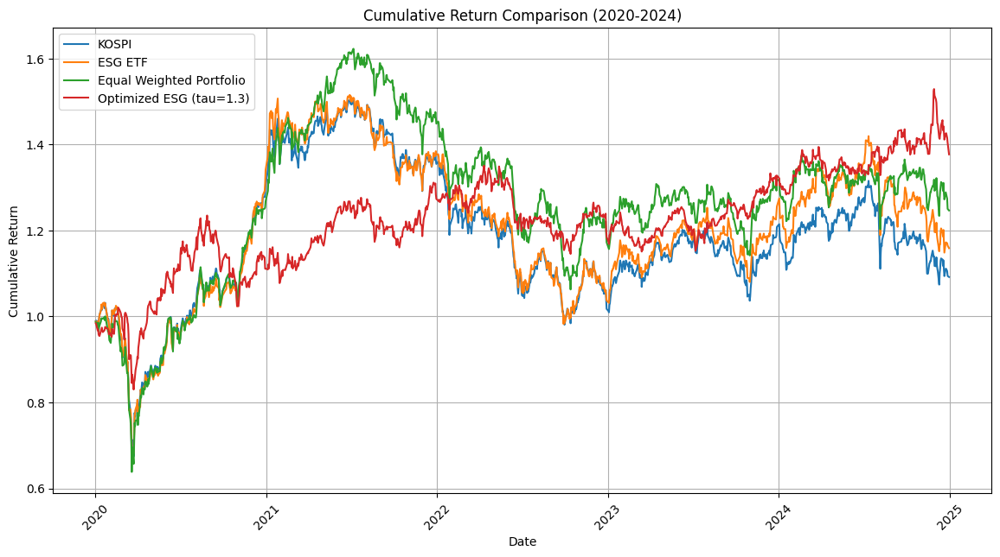
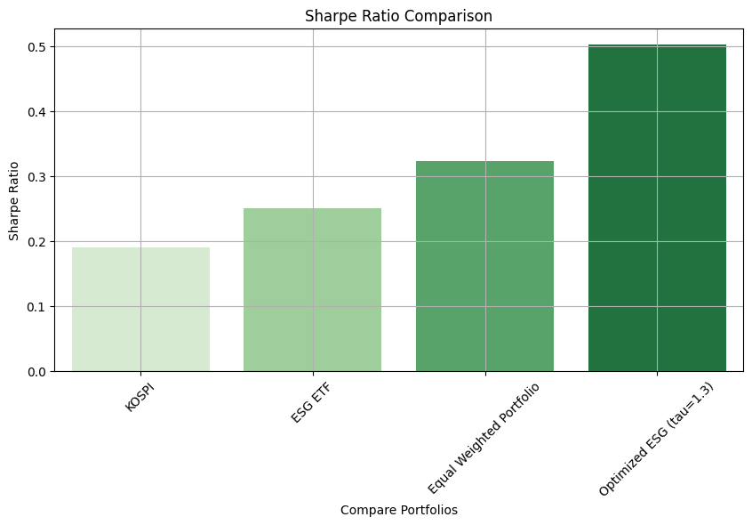
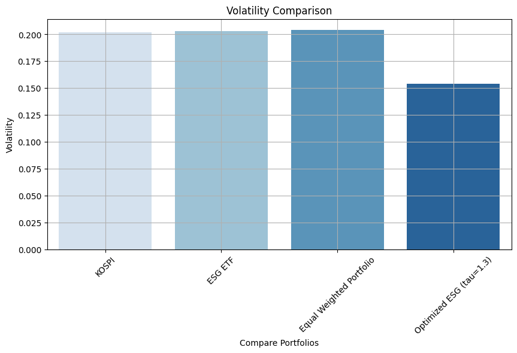
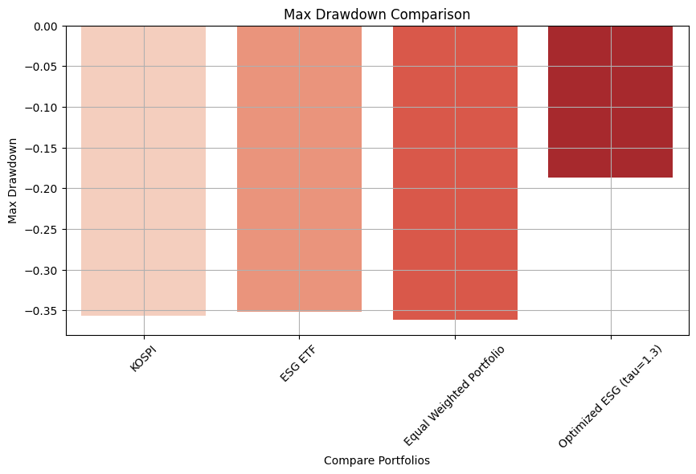
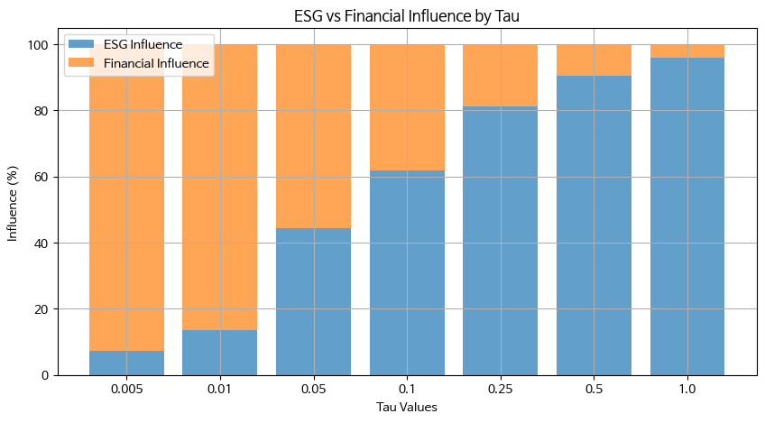

# LEPOS Post-Graduation Research: Backtesting the LLM-ESG Portfolio

> After the graduation exhibition (Nov 2024), the optimization model was refined and
> validated through a series of backtesting experiments (Jan–Mar 2025) conducted for a
> follow-up academic paper under the guidance of the project adviser.
> This document summarizes the methodology and final results. All referenced data files
> and charts live in this directory.

## 1. Research Questions

1. Does a portfolio optimized with **LLM-predicted ESG scores** outperform standard
   benchmarks (KOSPI index, ESG ETF, equal-weighted portfolio) over a 5-year horizon?
2. How should ESG views be injected into the **Black-Litterman** framework so that the
   result stays economically interpretable?
3. What is the optimal strength (`tau`) for blending ESG views against market-implied
   returns?

## 2. Methodology

### 2.1 Improved Black-Litterman view construction

The original graduation-project model collapsed all rating agencies into a single
averaged ESG score and injected it as if it were an expected return. The revised design
keeps each agency's view separate and lets user trust weights modulate them:

- **P matrix (5 × N)** — one row per rating agency (MSCI, S&P, Sustainalytics, ISS,
  KCGS/ESG기준원), where each row contains that agency's ESG scores predicted by a
  GPT-3.5-turbo model fine-tuned to mimic the agency's rating behaviour from news text.
- **Q vector** — `Q = P · user_trust`, i.e. agency views weighted by the investor's
  trust in each agency (uniform trust assumed in the experiments).
- **Ω (Omega)** — investor confidence matrix, allowing biased agencies to be discounted.
- Posterior returns: `μ = τ·Σ·r_m + Pᵀ(Ω⁻¹P)Q` combined with a **Ledoit-Wolf shrunk
  covariance matrix** for numerical stability.

### 2.2 Backtest design

- **Universe**: KOSPI-listed companies covered by the LLM ESG scoring pipeline
  (see [`llm_esg_data.csv`](llm_esg_data.csv)).
- **Period**: 2020–2024, with **annual rebalancing** — the portfolio for year *t* is
  always constructed from year *t−1* ESG scores (look-ahead bias removed in the
  redesigned experiment).
- **Price data**: daily close prices from KRX
  ([`krx_5yr_prices.csv`](krx_5yr_prices.csv)).
- **Constraints**: long-only, per-asset weight cap, weights sum to 1, solved as a
  quadratic program.
- **Benchmarks**: KOSPI index, a Korean ESG ETF, and an equal-weighted portfolio of the
  same universe.

## 3. Results

### 3.1 Benchmark comparison (5-year backtest, 2020–2024)

| Portfolio | 5y Cumulative Return | CAGR | Volatility | Sharpe | Max Drawdown | Calmar |
|---|---|---|---|---|---|---|
| KOSPI | 1.092 | 0.018 | 0.202 | 0.190 | 0.357 | 0.051 |
| ESG ETF | 1.159 | 0.031 | 0.203 | 0.251 | 0.352 | 0.087 |
| Equal-weighted | 1.247 | 0.046 | 0.204 | 0.323 | 0.362 | 0.128 |
| **Optimized ESG (τ = 1.3)** | **1.377** | **0.068** | **0.154** | **0.503** | **0.187** | **0.362** |

The LLM-ESG optimized portfolio dominates every benchmark on every metric: highest
cumulative return with ~25 % lower volatility and roughly half the maximum drawdown.

| | | |
|---|---|---|
|  |  |  |

### 3.2 Tau sensitivity and optimization

`tau` controls how strongly ESG views tilt the market-implied returns. A sweep plus
Bayesian optimization (scikit-optimize) over τ ∈ [0.001, 1.0] found CAGR and cumulative
return are maximized near **τ ≈ 0.6**, and the refined τ-grid experiment identified
τ = 1.3 as the volatility-minimizing / Sharpe-maximizing point. Sensitivity is mild
because Ledoit-Wolf shrinkage dampens the effect of τ on the posterior.

The finding that returns keep improving while a substantial ESG tilt is applied supports
the core thesis: **incorporating text-derived ESG signals improves long-horizon,
risk-adjusted performance** rather than sacrificing it.

## 4. Files in this directory

| File | Description |
|---|---|
| `llm_esg_data.csv` | LLM-predicted ESG scores per company/year/agency (Q-vector input) |
| `krx_5yr_prices.csv` | Daily close prices for the universe + benchmarks (KRX) |
| `experiment_results_final.csv` | Hyperparameter sweep (ESG weight × shrinkage × max weight) |
| `investment_weights.csv` | Optimized weights per stock per rebalancing year (τ ≈ 0.6) |
| `portfolio_weights_2020..2024.csv` | Final per-year optimized weight tables (τ = 1.3 run) |
| `portfolio_daily_returns_2020_2024.csv` | Daily returns of experiment vs. benchmark portfolios |
| `*.png` | Result charts (cumulative return, Sharpe, volatility, MDD, Calmar, τ influence) |

The backtesting notebook is at
[`notebooks/06_portfolio_optimization/esg_portfolio_backtest.ipynb`](../../notebooks/06_portfolio_optimization/esg_portfolio_backtest.ipynb).

> **Note**: The follow-up paper work was handed over to the adviser after these
> experiments; this directory preserves the reproducible artifacts produced by the team.
